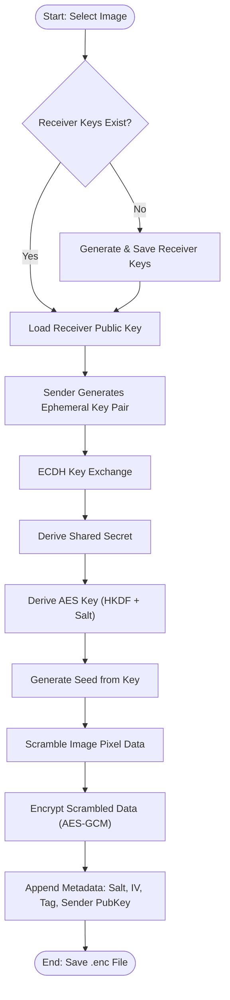
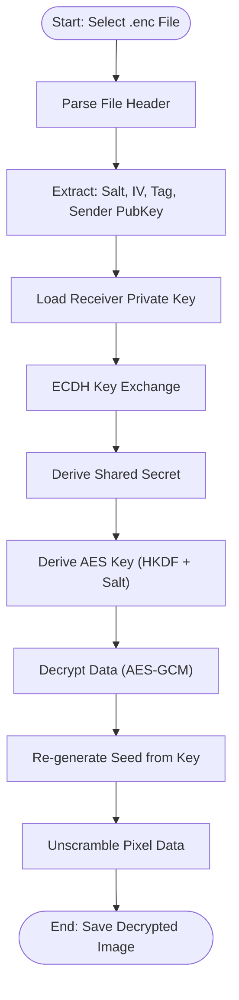

# Image Encryption using ECDH and AES-GCM

## Overview

This project implements a secure image encryption system using **Elliptic Curve Diffie-Hellman (ECDH)** for key exchange and **AES-GCM** (Galois/Counter Mode) for authenticated encryption. It also includes an image scrambling technique to enhance security against statistical attacks and a suite of cryptographic attack simulations to verify robustness.

## Features

*   **Secure Key Exchange**: Uses ECDH (SECP256R1) to securely derive shared secrets between sender and receiver.
*   **Strong Encryption**: Implements AES-GCM for simultaneous confidentiality and authenticity.
*   **Image Scrambling**: Pixel permutation based on a deterministic seed derived from the shared key and salt to disrupt image structure.
*   **Security Analysis Metrics**: Automatically calculates and displays:
    *   **Entropy**: Measures randomness of the encrypted image.
    *   **SSIM (Structural Similarity Index)**: Compares the quality of the decrypted image with the original.
    *   **Correlation Coefficient**: Analyzes the linear relationship between adjacent pixels.
    *   **NPCR (Number of Pixels Change Rate)** & **UACI (Unified Average Changing Intensity)**: Measures resistance to differential attacks.
    *   **Histograms**: Visualizes the distribution of pixel values.
*   **Attack Simulation**: Includes a separate tool to simulate various cryptographic attacks (Brute-force, Cipher-only, Known-plaintext, Side-channel timing) to demonstrate security.
*   **GUI**: User-friendly graphical interface using `tkinter` for both encryption/decryption and attack simulations.
*   **Format Support**: Supports standard image formats (JPG, PNG, BMP) and DICOM (.dcm) medical images.

## System Architecture & Workflow

### 1. Encryption Process
The following flowchart illustrates how an image is securely encrypted using ECDH key exchange and AES-GCM.



### 2. Decryption Process
The decryption process reverses the steps, ensuring only the holder of the private key can recover the original image.



## Project Structure

*   `Codes/Encrypt_ECDH_v9.py`: The main application for image encryption and decryption.
*   `Codes/Cryptographic attack Sim.py`: A simulation tool to test the system against common cryptographic attacks.
*   `Codes/Image analysis.py`: Helper script for image analysis (if applicable).

## Prerequisites

*   Python 3.x
*   Required Python libraries:

```bash
pip install cryptography numpy opencv-python matplotlib scikit-image scipy pydicom pycryptodome Pillow
```

## Installation

1.  Clone the repository or download the project files.
2.  Navigate to the `Codes` directory:
    ```bash
    cd Codes
    ```
3.  Install the dependencies using the command above.

## Usage

### Image Encryption & Decryption

1.  Run the main encryption script:
    ```bash
    python Encrypt_ECDH_v9.py
    ```
2.  **Encrypt Image**:
    *   Click "Encrypt Image".
    *   Select an image file (JPG, PNG, etc.).
    *   The tool will generate a receiver key (if not present), derive a session key, scramble the image, encrypt it, and save it as `.enc`.
    *   Analysis metrics (Entropy, SSIM, etc.) will be displayed in the console.
3.  **Decrypt Image**:
    *   Click "Decrypt Image".
    *   Select the `.enc` file.
    *   The tool will decrypt and unscramble the image, saving it as `_decrypted.png`.

### Attack Simulation

1.  Run the attack simulator:
    ```bash
    python "Cryptographic attack Sim.py"
    ```
2.  **Load File**: Load an encrypted `.enc` file or create a sample one.
3.  **Run Tests**: Click "Run All Tests" to perform simulations like Brute-force, Cipher-only analysis, and Side-channel timing checks.
4.  **Generate Report**: The tool can generate a text report of the attack simulation results.

## Security Details

*   **Key Derivation**: HKDF (SHA-256) is used to derive the AES key from the ECDH shared secret.
*   **Encryption**: AES-256 in GCM mode with a random 96-bit IV.
*   **Scrambling**: The image pixels are shuffled using a seeded random number generator (NumPy) before encryption to flatten the histogram and reduce correlation.

## Authors

**Malcolm Cephas**
- GitHub: [@malcolm-cephas](https://github.com/malcolm-cephas)

**Shalini Sinha**
- GitHub: [@Shalini-git-hub](https://github.com/Shalini-git-hub)

**A B Vishvajeeth**
- GitHub: [@ABVishvajeeth](https://github.com/ABVishvajeeth)

**Medhansh Jani**


